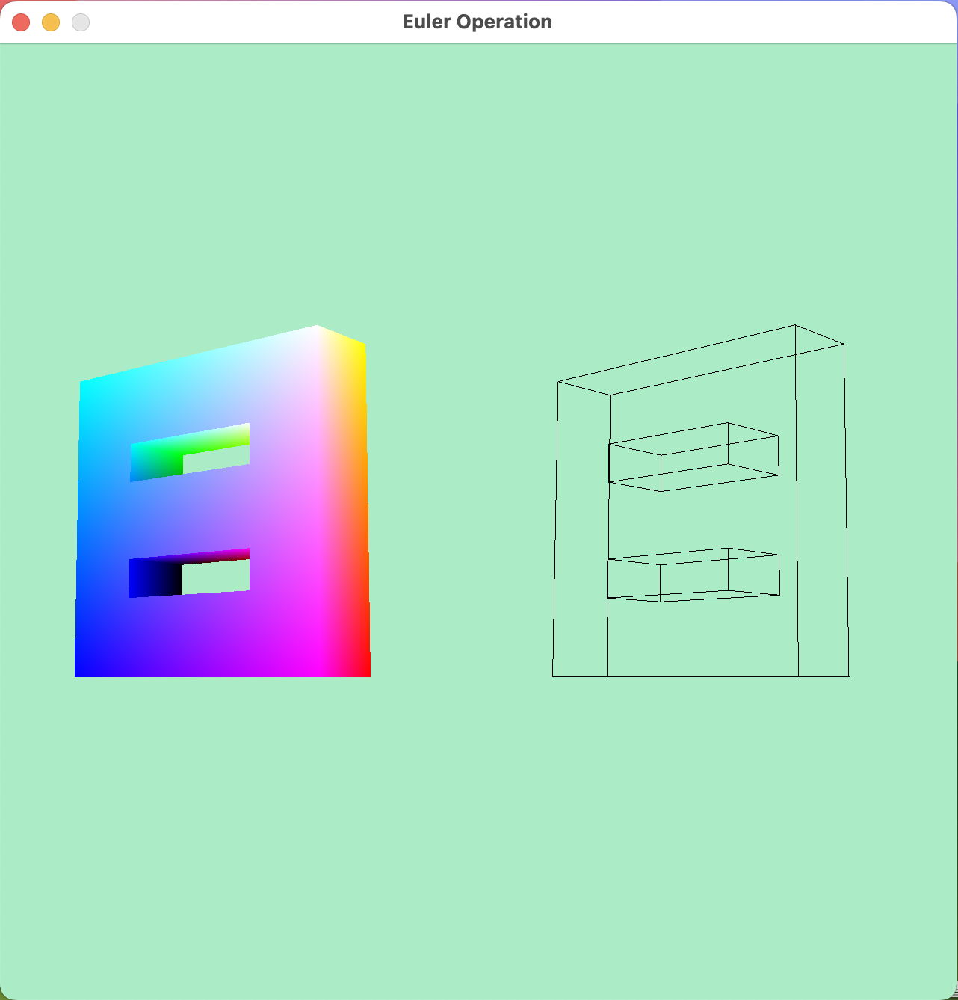

# EulerOperation

> 《三维CAD建模》课程作业
>
>  大程作业的内容包括：
>
>  1）定义半边数据结构；
>
>  2）基于半边数据结构，实现五个基本欧拉操作；
>
>  3）基于欧拉操作，实现扫掠操作（必须允许二维区域带多个内环），并将基于扫掠操作构建的实体模型进行真实感图形显示。




## 1.1 实验环境及依赖

实验环境：macOS Sonoma 14.1.1  芯片：Apple M1 Pro

Requirements：通过 homebrew 安装 `GLFW`，`GLUT`，`GLEW`, `GLM ` 等依赖库


## 1.2 编译方法

```shell
1) cd ./build # 进入 build 目录
2) cmake . # 编译
3) make # 编译
4) ./EulerOperation 0.model_8 1.model_C 2.model_A 3.model_D # 运行

```


## 1.3 操作说明

切换视角:  按住鼠标左键并拖拽 or 方向键 ⬆️ ⬇️ ⬅️ ➡️ 

切换模型:  Enter 键


**样例模型文件格式说明（如 0.model_8 文件等）：**

第一行表示 sweeping 向量（x, y, z）以及距离 d

其余行前三位表示实体模型边界点的坐标（x, y, z），最后一位表示该点位于第 n 个环上（如 0 是外环，1，2，3 等是内环）

